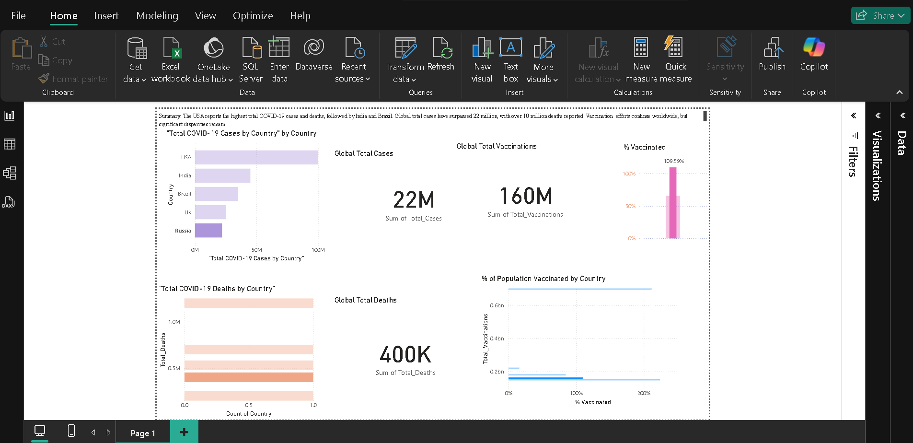

# COVID-19 Data Analytics Dashboard in Power BI

This project is an interactive Power BI dashboard that analyzes global COVID-19 data. It visualizes total cases, deaths, vaccinations, and the percentage of the population vaccinated by country. The dashboard leverages DAX measures, data modeling, and conditional formatting to deliver clear insights and highlight disparities across countries.

## 🚀 Features
- **Clustered Bar Charts:** Compare total COVID-19 cases and deaths by country.
- **KPI Cards:** Display global totals for cases, deaths, and vaccinations.
- **% Vaccinated Measure:** Calculates and visualizes the share of the population vaccinated.
- **Conditional Formatting:** Uses color gradients to emphasize vaccination rates (green for high, red for low).
- **Summary Insights:** Text box summarizing key findings for quick interpretation.

## 🛠 Built With
- **Power BI Desktop** for data modeling and visualization
- **DAX** for custom measures
- **Sample dataset:** Global COVID-19 statistics (CSV/Excel)

## 📸 Screenshots

## 💡 How to Use
1. Clone this repository or download the files.
2. Open `COVID-19 Dashboard.pbix` in **Power BI Desktop**.
3. Explore the visuals, hover over charts for tooltips, and review insights.

## ✅ Key Learnings
- Created calculated measures for vaccination percentages.
- Applied data colors using conditional formatting to drive visual storytelling.
- Delivered an executive-style dashboard to communicate trends and gaps effectively.

## 🔗 Connect
- [LinkedIn: Sasi Kumar Gadhi](https://linkedin.com/in/sasi-kumar-gadhi-83b020205)

---

🚀 *This project showcases practical data engineering & analytics skills using Power BI and can be extended with more advanced features like slicers, drill-throughs, or time-series forecasting.*

